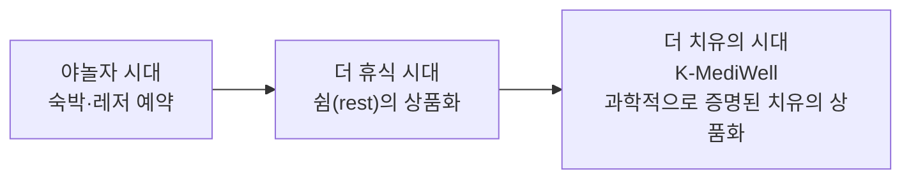
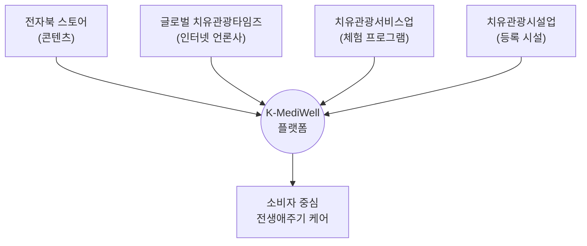
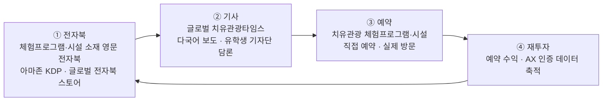

# K-MediWell 기능명세서

> 근거 문서: 「2026년 모두의 창업 프로젝트 1R 사업계획서」(국립공주대학교 산학협력단 제출, 작성자 이용근, 2026.8)
> 대상 코드베이스: `C:\Users\User\kmediwell` (Gencow 백엔드 + Vite/React 프론트엔드)
> 작성일: 2026-08-12 · 버전: v0.8 (핵심 비전 — 야놀자→더휴식→더치유 산업 진화, 4축 통합 플랫폼·전생애주기 케어 반영)

---

## 0. 핵심 비전 — K-MediWell, 치유관광 시대의 플랫폼

### 산업의 진화: 야놀자 시대 → 더휴식 시대 → 더 치유의 시대

한국 여가·숙박 산업은 세 단계로 진화하고 있으며, K-MediWell은 그 세 번째 단계를 준비하는 플랫폼이다.

1. **야놀자 시대** — 숙박·레저를 "예약"하는 슈퍼앱 시대. 야놀자(현 NOL)는 숙박 예약에서 출발해 여행·레저·문화를 아우르는 여가 산업 표준 플랫폼으로 자리잡았다.[^16]
2. **더 휴식 시대** — 이미 진행 중인 다음 단계. '더휴식'은 강남·홍대 등 도심 건물을 매입해 '웰니스 호스텔'로 전환하고, 정적·동적 휴식으로 세분화한 콘텐츠 룸을 야놀자 플랫폼과 협업해 선보이는 등, 단순 숙박을 넘어 **"쉼(rest)"을 상품화**하는 단계로 나아가고 있다.[^17]
3. **더 치유의 시대(K-MediWell)** — 본 팀이 예측하는 다음 단계. "쉬는 것"에서 한 걸음 더 나아가, 뇌과학으로 **객관적으로 증명된 "치유"를 상품화**하는 단계다. K-MediWell은 뉴로피드백 DX 기반 AX 인증(§1.1 기술 전략)으로 치유 효과를 수치로 증명한다는 점에서 앞선 두 단계와 근본적으로 구별된다.



### 하나의 플랫폼, 네 개의 축

K-MediWell은 아래 네 요소를 하나의 플랫폼 안에 통합해, 소비자를 중심으로 치유관광 시장 전체를 연결하는 핵심 축이 되고자 한다.



| 축 | 역할 | 관련 FR |
|---|---|---|
| 전자북 스토어 | 한국 치유문화를 세계에 소개하는 콘텐츠의 입구 | FR-4 |
| 글로벌 치유관광타임즈 | 그 콘텐츠에 신뢰와 담론을 더하는 다국어 인터넷 언론 | FR-7 |
| 치유관광서비스업 | 법이 신설한 체험 프로그램 사업자를 실제 예약으로 연결하는 창구 | FR-1~3 |
| 치유관광시설업 | 법이 신설한 시설 사업자를 브랜드로 등록·홍보하는 창구 | FR-1 |

이 네 축이 각자 흩어진 서비스가 아니라 하나의 플랫폼 안에서 유기적으로 연결될 때, 소비자는 "책 한 권 읽기"에서 시작해 "뇌파로 나를 이해하기"(FR-2) → "실제로 방문해 치유를 경험하기"(FR-1~3) → "그 경험이 다시 나의 여정으로 기록되기"(FR-2.3 스트레스 지수 추이)까지, 한 사람의 치유 여정 전체를 하나의 플랫폼에서 반복적으로 함께할 수 있다. 이것이 K-MediWell이 정의하는 **"토탈 전생애주기 케어 서비스"**다 — 한 번의 방문으로 끝나는 상품이 아니라, 이용자가 살아가는 동안 반복해서 자신의 치유 상태를 측정하고, 맞는 콘텐츠·시설을 추천받고, 다시 방문하는 순환(§1.4 콘텐츠-커머스 선순환 구조)이 평생에 걸쳐 이어지는 서비스다.

---

## 1. 서비스 개요

### 1.1 사업 포지셔닝 — 치유관광 팬덤 마케팅

**K-MediWell**은 기존에 성장해 온 한국 **의료·웰니스관광 산업**을 기반으로, 한국 전통 치유문화(훈민정음·국악풍류·오정법·전일의학)를 콘텐츠 삼아 **전 세계 한류문화 팬덤**, **해외동포**, **국내 체류 해외 유학생**을 대상으로 하는 "**치유관광 팬덤 마케팅**"을 통해 K-MediWell 시장을 다시 성장시키는 것을 사업 목표로 한다. 뇌파(EEG) 기반 **AX 인증**(Gold/Silver/Bronze)으로 신뢰를 객관화한 **웰니스관광지 예약**과 **전자북** 콘텐츠를 하나의 플랫폼에서 제공한다.

전자북 콘텐츠는 추상적인 문화 소개에 머물지 않고, **실제 예약 가능한 치유관광 서비스 체험프로그램과 치유관광시설을 소재**로 삼아 전통 치유문화 기반의 "**한국형 치유관광**"을 세계에 알리는 데 초점을 둔다 — 읽는 즉시 방문·예약으로 이어질 수 있도록 콘텐츠와 실제 시설·프로그램을 1:1로 연결하는 것이 원칙이다. 나아가 2026년부터 「치유관광산업 육성에 관한 법률」로 신설되는 **치유관광서비스업**·**치유관광시설업**(§1.2)을 이 콘텐츠·홍보 구조로 가장 먼저 알리고 선도함으로써, 새롭게 열리는 치유관광시장을 선점하는 것을 전략 목표로 한다.

#### 왜 지금인가 — 한류관광에서 K-원류관광으로

2025년 6월 공개된 넷플릭스 애니메이션 「케이팝 데몬 헌터스」는 한국 전통 무속(샤머니즘)과 자기극복 서사를 소재로 삼아, 공개 75일 만에 영화·시리즈 통틀어 넷플릭스 역대 최다 누적 시청 수(2억 6,600만)를 기록하며 종전 1위 오징어 게임 시즌1(2억 6,520만)·웬즈데이 시즌1(2억 5,210만)을 제쳤다.[^9] 이어 2026년 3월, 방탄소년단(BTS)이 한국 전통문화를 소재로 한 앨범 『ARIRANG』으로 미국 빌보드 200 앨범 차트 2주 연속 1위(발매 첫 주 64.1만 장, 듀오·그룹 최대 판매량 기록)와 영국 오피셜 앨범 차트 1위를 동시에 달성했다.[^10]

두 사건은 우연이 아니라, 한류의 중심이 K-팝·K-드라마라는 '표층 콘텐츠'에서 그 밑에 흐르는 **한국 전통문화·정신문화라는 '원류(源流)'**로 옮겨가고 있다는 신호로 읽을 수 있다. K-MediWell은 이 흐름을 **한류관광에서 K-원류관광(K-Origin Tourism)으로의 전환**으로 규정하고, 이 원류관광을 뇌과학 기반 치유관광산업으로 육성하는 것이 지금 이 시점에 갖는 전략적 의미라고 본다. 검증된 시장 성장(§1.2 성장 실적), 아직 선점되지 않은 신설 업종(§1.2 신설 업종), 세계적으로 이미 검증된 콘텐츠 수요(케데헌·ARIRANG)가 동시에 겹치는 지금이 K-MediWell에게는 **미래가치가 매우 높은 블루오션 진입 시점**이다.

#### 왜 이 팀인가 — 10년간 쌓아온 실행력

K-MediWell은 하루아침에 만들어진 아이디어가 아니다. 이용근 교수를 중심으로 한 팀은 **2016년부터 국립공주대학교 스마트의료웰니스관광대학원**에서 여행인문학·치유관광을 연구하며, 오정법(五正法)·전일의학(홀리스틱 의학)·브레인 에너지 이론(위 "기술 전략" 참고) 등 치유 콘텐츠의 이론적 기반을 10년 가까이 축적해 왔다.[^14] 이 연구는 **K-MediWell 글로컬 프로젝트팀** 명의로 이어지고 있으며, 고전 철학(주역·능엄경 등)과 현대 뇌과학을 결합한 프로그램을 실제로 설계·운영하며 최근에도 계속 확대하고 있다(§1.6 실행 실적).[^15]

10년 가까운 이론·콘텐츠 축적이 있었기에, 2026년 4월 「치유관광산업 육성에 관한 법률」이 시행되면서 비로소 그동안 쌓아온 자산이 제도적 근거를 얻어 사업화될 수 있는 창구가 열렸다. 즉 이 사업은 법이 새로 만든 시장에 뒤늦게 뛰어드는 것이 아니라, **10년간 준비된 자산이 법 제도와 만나 실현 가능성이 매우 높아진 것**이라는 점이 핵심 논거다.

#### 기술 전략 — 뇌과학 기반 치유관광

치유관광을 "느낌·후기" 중심의 저부가가치 관광이 아니라 **과학을 기반으로 한 고부가가치 산업**으로 육성해야 하는 당위성은 하버드 의과대학 정신의학과 크리스토퍼 M. 팔머(Christopher M. Palmer) 교수의 저서 『브레인 에너지(Brain Energy)』에 근거를 둔다.[^7] 팔머 교수는 우울·불안 등 현대인의 정신적 문제 상당수가 심리적 결함이 아니라 **뇌세포(미토콘드리아)의 에너지 대사 부족**에서 비롯된다는 "뇌 에너지 이론"을 제시했다. K-MediWell은 이 관점을 AI·로봇 시대로 급변하는 환경에 적응하며 겪는 번아웃에 확장 적용한다 — 이 번아웃 역시 근본 원인은 심리적 나약함이 아니라 **뇌의 에너지 상태 부족**이라고 보고, 이를 객관적으로 측정할 지표로 **뉴로피드백 기술의 뇌파(EEG)**를 치유관광 프로그램의 측정 기준으로 채택하는 근거로 삼는다.

이 기술 전략에 따라 K-MediWell은 **뉴로피드백 DX 기술을 활용한 뇌과학 기반 치유관광 산업 육성**을 핵심 기술 전략으로 삼는다. 이를 위해 뇌파(EEG) 측정값을 근거로 한 다양한 치유관광 체험 프로그램을 지속적으로 개발하고 있으며(FR-2), 이 접근의 실제 운영 실적은 §1.6을 참고한다.

### 1.2 시장 기회 및 법적 근거

| 근거 | 내용 |
|---|---|
| 법적 근거 | 「치유관광산업 육성에 관한 법률」— 2025.4.8 공포, **2026.4.9 시행**[^1]. 치유관광사업 업종 신설, 치유관광산업지구 지정, 인력양성·종합정보체계 구축의 제도적 근거 |
| 신설 업종 · 선점 전략 | 법 시행으로 **치유관광서비스업**(체험프로그램 운영)·**치유관광시설업**(시설 등록) 두 업종이 새로 생긴다. 아직 이 업종을 대표하는 민간 브랜드가 없는 시점에, K-MediWell이 전자북(FR-4)과 치유관광타임즈(FR-7)로 이 업종을 가장 먼저 홍보·소개해 신규 치유관광시장의 선도 브랜드로 자리잡는 것을 전략으로 한다 |
| 시장 전망 | 야놀자리서치는 K-MediWell(치유관광) 시장이 **2035년 1,000조원** 규모로 성장할 것으로 전망[^2] |
| 성장 실적 | 외국인 환자 유치 **2023년 61만명 → 2024년 117만명 → 2025년 201만명**(사상 첫 200만 돌파)[^3][^5] — **1년 만에 거의 두 배로 급증**하는 시장으로, 팬데믹 이후 3년 연속 매년 약 2배 수준 증가세 |
| 전체 관광객 대비 고부가가치 | 2025년 방한 외국인 **전체**는 약 2,009만명(사상 첫 2천만 돌파), 관광수입 약 29.4조원 — **1인당 약 146만원**.[^11] 같은 해 **의료관광객**은 201만명, 지출액 12.5조원(동반자 포함) — **1인당 약 622만원**.[^12] 즉 의료관광객 1인당 지출액이 일반 관광객의 **약 4.3배**(직접 계산값)[^13] — "저부가가치 일반관광에서 고부가가치 치유관광으로" 전환해야 하는 이유를 뒷받침하는 수치 |

### 1.3 목표 사용자

| 페르소나 | 설명 | 이 문서에서의 범위 |
|---|---|---|
| **전 세계 한류문화 팬덤** | K-팝·K-드라마를 계기로 한국 전통 치유문화를 체험하고 싶은 외국인 관광객 (주 타겟) | 전 기능 (열람·측정·예약·구독·구매) |
| **해외동포 (약 820만명)**[^4] | 한국 문화·언어에 친숙하며 국내 방문·투자 여력이 있는 잠재 방문객이자 콘텐츠 확산 채널 | 전자북 구독, 콘텐츠 열람·공유, 예약 |
| **국내 체류 해외 유학생** | "글로벌 셀러"이자 "치유관광 기자단"으로 활동 — 자국어 기사 작성, 콘텐츠 홍보 | 콘텐츠 열람 + 크리에이터 신청 (작성 도구는 Phase 2) |
| **웰니스관광지 운영자 (B2B)** | 문체부·관광공사 공식 선정 88개소 시설 | Phase 2 이후 — 이 문서에서는 데이터 등록 대상으로만 다룸 |
| **플랫폼 운영자** | K-MediWell 팀 | 대시보드/정산 — Phase 2 이후 |

### 1.4 핵심 개념 — 콘텐츠-커머스 선순환 구조

전자북·기사 콘텐츠로 관심을 유발하고 실제 예약까지 이어지는 "콘텐츠-커머스 선순환 구조"가 이 서비스의 핵심 메커니즘이다. 반짝 유입이 아니라, 예약·구독에서 발생한 수익과 데이터가 다시 콘텐츠 제작으로 재투자되는 순환 구조를 지향한다.



| 단계 | 내용 | 대응 기능 |
|---|---|---|
| ① 전자북 | 실제 치유관광 서비스 체험프로그램·치유관광시설을 소재로 한국형 치유관광을 소개하는 전자북을 **영어판**으로 제작해 아마존을 비롯한 전 세계 전자북 스토어에 출간·구독 등록 | FR-4(전자북 스토어), FR-4.5(구독) |
| ② 기사 | "글로벌 치유관광타임스" 다국어 인터넷 언론이 전자북에 담긴 시설·프로그램을 취재·보도하며 담론을 확산 | FR-7(치유관광타임즈) |
| ③ 예약 | 전자북·기사에서 소개된 치유관광 서비스 체험프로그램·시설을 바로 예약해 실제 방문으로 연결 | FR-1~3(탐색·상세·예약) |
| ④ 재투자 | 예약 수익(수수료)과 AX 인증 데이터가 다음 전자북 제작·시설 확장의 근거·재원이 됨 | FR-2(AX 인증), 로드맵 3차 조달 |

### 1.5 사업계획서 4단계 시장과 화면의 매핑

문화체육관광부가 선정한 **웰니스관광지 88선**이 시설 확장의 근간이다. 그 중 **외래객 유치를 위한 20선**을 먼저 기반으로 시작하고, 나머지 68개소는 점진적으로 확장한다.

| 단계 | 대상 | 이 앱에서 대응하는 기능 |
|---|---|---|
| 1차 | 전자북 100여권 | 전자북 스토어 (`EbookStore`) |
| 2차 | 문체부 선정 웰니스관광지 88선 중 **외래객 유치용 20선** | 웰니스관광지 탐색·예약 (`Explore`, `SiteDetail`, `BookingCheckout`) — 우선 기반 |
| 3차 | 88선 중 **나머지 68개소** | 동일 스키마로 데이터만 점진적 확장 (`sites` 테이블) |
| 4차 | 치유관광산업법 신설 업종(**치유관광서비스업**·**치유관광시설업**) 대상 신규 시설·서비스 | 동일 스키마 확장, 신규 category 추가 — 신설 업종 선점(§1.2) |

### 1.6 실행 실적 (Traction)

기획 단계에 머무르지 않고 이미 실행한 실적을 근거로 한다.

| 구분 | 실적 |
|---|---|
| 콘텐츠 파이프라인 | 한국어 전자북 원고 **20여건** 확보. 이 중 **8권을 영어판으로 번역해 아마존 KDP에 출간 완료** (이 앱 `ebooks` 시드 데이터와 일치, §5)[^6] |
| 뇌과학 기반 체험 프로그램 운영 | 충청남도교육청 2026학년도 여름방학 **"꿈키움 학교 밖 교육" 창의적 체험활동**에서 국립공주대 스마트의료웰니스관광대학원(이용근 주임교수 설계)이 뇌과학 기반 K-치유관광 프로그램을 8일간 운영 — 청소년 참가자의 맨발걷기(어싱)·국악치유음악·치유명상·치유요가 체험 전후 뇌파를 측정해 변화를 증명. 국악치유음악 이규영, 치유명상 강태원, 치유요가 정효원, 뇌파측정 박보정 전문가 협업[^8] |

---

## 2. 정보구조 (IA)

```
K-MediWell (SPA, 탭 네비게이션)
├── 홈 (Home)
│   ├── 히어로 — EEG 측정 유도
│   ├── [신규] 치유관광타임즈 기사 티저 스트립
│   ├── 카테고리 칩
│   └── 외래객 특화 20선 프리뷰 (Top6)
├── 탐색 (Explore)
│   └── 카테고리 필터 → 시설 목록 → 상세(SiteDetail) → 예약(BookingCheckout) → 확정(Journey로 이동)
├── [신규] 치유관광타임즈 (News)
│   └── 기사 목록(다국어) → 기사 상세 → 관련 전자북/시설 CTA
├── 전자북 (EbookStore)
│   └── 목록 → 상세(선택 패널) → 관련 시설 연결
├── 여정 (Journey) — 로그인 필요
│   ├── 스트레스 지수 추이
│   └── 예약 내역
├── 뇌파 측정 (Measure) — 로그인 필요, 홈에서 진입
└── 인증 (AuthForm) — 로그인/회원가입
```

전역 요소: 상단 Nav(언어 스위처 포함 예정), 실시간 연결 상태 표시.

---

## 3. 기능 요구사항

우선순위: **P1** = 현재 앱의 핵심(이미 구현), **P2** = 사업계획서 Phase 1(0~6개월) 내 추가 필요, **P3** = Phase 2 이후.
구현상태: ✅완료 / 🟡부분 / ⬜미구현.

### FR-1. 웰니스관광지 카탈로그 & 탐색 — P1 · ✅

| ID | 요구사항 | 비고 |
|---|---|---|
| FR-1.1 | 카테고리(자연숲치유/뷰티스파/힐링명상/한방/스테이/푸드)별 필터링 | `Explore.tsx` |
| FR-1.2 | 시설 상세: 설명, AX 인증 근거, 프로그램/가격 | `SiteDetail.tsx` |
| FR-1.3 | "외래객 특화 20선" 홈 프리뷰 | `sites.isTop20` 필터 |
| FR-1.4 | 문체부 선정 웰니스관광지 88선 전량 등록·관리 (§1.5) — 외래객 유치용 20선 우선, 나머지 68개소 순차 확장 | 현재 시드 5건 → 20건(P2) → 88건(P3) 확장 필요 |

### FR-2. EEG 측정 & AX 인증 추천 — P1 · ✅

치유관광을 과학 기반 고부가가치 산업으로 육성한다는 기술 전략(§1.1 "기술 전략")의 실행 수단 — **뉴로피드백 DX 기술**로 뇌파를 측정하고, 그 값을 근거로 치유 유형을 추천한다.

| ID | 요구사항 | 비고 |
|---|---|---|
| FR-2.1 | 뇌파(α/θ/β) 측정 시뮬레이션 | `healing.measure` — 실기기 연동 전 시연용 |
| FR-2.2 | Agent AI 기반 맞춤 치유 유형 추천(점수 %) | `healing.recommend` |
| FR-2.3 | 측정 이력 및 스트레스 지수 추이 그래프 | `Journey.tsx` |
| FR-2.4 | 시설별 AX 인증 등급(Gold/Silver/Bronze) 표기 | `AxBadge.tsx` |
| FR-2.5 | 실제 EEG 디바이스 연동 | ⬜ 미구현 — 사업계획서상 Phase 1 예산 항목(900만원), 이 문서 범위 밖(하드웨어 연동) |
| FR-2.6 | 뇌파 기반 다양한 치유관광 체험 프로그램 개발 | 🟡 진행중 — 충남교육청 "꿈키움 학교 밖 교육"에서 뇌파기반 K-치유관광 프로그램을 실제 운영한 실적 보유(§1.6)[^8]. 이 앱에서는 `healing.recommend`의 추천 카테고리 확장으로 대응 |

### FR-3. 예약 & 결제 — P1 · ✅ (🟡 실결제 미연동)

| ID | 요구사항 | 비고 |
|---|---|---|
| FR-3.1 | 날짜 선택, 플랫폼 수수료(8%) 자동 계산 | `BookingCheckout.tsx` |
| FR-3.2 | 예약 생성 시 소유자(userId) 스코프 강제 | RLS, `bookings.create` |
| FR-3.3 | 예약 내역 조회(여정 화면) | `bookings.list` |
| FR-3.4 | 실제 PG(결제대행사) 연동 | ⬜ 사업계획서상 "예약 수수료 5~10%" 매출모델의 전제 조건 — P2 필수 |

### FR-4. 전자북 스토어 & 구독 — P1 · ✅ (🟡 실판매 미연동)

"먼저 영어판 전자북을 구독하게 한다"는 팬덤 마케팅 1단계를 지원하기 위해, 단순 열람을 넘어 **구독(관심 등록)** 기능을 구현했다.

| ID | 요구사항 | 상태 |
|---|---|---|
| FR-4.1 | 전자북 목록/카드 그리드, 카테고리 표기 | ✅ `EbookStore.tsx` |
| FR-4.2 | 관련 시설로 연결(콘텐츠→예약 퍼널의 일부) | ✅ `relatedSiteId` |
| FR-4.3 | 실제 구매(아마존 KDP 딥링크 또는 자체 결제) | ⬜ 현재는 정보 열람만 가능. 사업계획서상 "저자 30%·플랫폼 70%" 배분 전제 — P2 |
| FR-4.4 | 전자북 QR코드 → 예약 페이지 직결 | ⬜ 사업계획서 "다음 라운드 실행 항목" 명시 — P2 |
| FR-4.5 | 전자북 구독(관심 등록) — 로그인 사용자가 관심 전자북에 구독, 실시간 구독 상태 토글 | ✅ `ebook_subscriptions` 테이블(RLS), `ebooks.subscribe`/`unsubscribe`/`mySubscriptions` 프로시저, `EbookStore.tsx` |
| FR-4.6 | 전자북 ↔ 치유관광타임즈 기사 양방향 연결 | ✅ 전자북 상세에서 관련 기사로, 기사 상세에서 관련 전자북으로 상호 딥링크 (`relatedEbookId` 필터) |

### FR-5. 인증/계정 — P1 · ✅

| ID | 요구사항 | 비고 |
|---|---|---|
| FR-5.1 | 이메일/비밀번호 회원가입·로그인·로그아웃 | better-auth |
| FR-5.2 | 소셜 로그인(Google 등) | ⬜ 미구현, `gencow add sso`로 추가 가능 |

### FR-6. 다국어 지원 (i18n) — P2 · 🟡 부분 구현 (한/영 완료, 중/일/베 미구현)

사업계획서의 타겟(해외 팬덤, 유학생)과 현재 앱(한국어 전용) 간 가장 큰 간극이었으나, 한/영 2개 언어는 구현 완료.

| ID | 요구사항 | 상태 |
|---|---|---|
| FR-6.1 | 언어 스위처 UI(상단 Nav): 영어 기본, 중국어·일본어·베트남어 순차 지원 (사업계획서 우선순위: 영어→중국어·베트남어 1순위→일본어 3순위) | ✅ 한/영 · ⬜ 중/일/베 (미번역 상태로 노출하면 폴백이 어색해 보류) |
| FR-6.2 | 정적 UI 텍스트 i18n화 (버튼, 라벨, 안내문) | ✅ `src/lib/i18n.tsx` — 신규 패키지 없이 자체 Context 구현 |
| FR-6.3 | 콘텐츠(시설 설명, 전자북 소개, 기사) 다국어 필드 또는 번역본 저장 | ⬜ 미구현 — `sites`/`ebooks` 설명은 한국어 고정. `articles`는 `locale` 필드로 언어별 별도 행 저장 방식 채택(FR-7 참고) |
| FR-6.4 | 통화 표시: 원화(₩)/달러($) 병기 또는 자동 환산 | ⬜ 미구현 — 기존 표기(시설 ₩, 전자북 $) 유지만 함 |

### FR-7. 치유관광타임즈 — 콘텐츠 퍼널 — P2 · 🟡 열람 UI 구현 완료 (작성 도구 제외)

"글로벌 치유관광타임스" — 전 세계 한류 팬덤·해외동포에게 한국 치유문화 전자북을 담론화해 소개하고, 국내 체류 해외 유학생 기자단이 자국어로 취재해 신뢰도를 높이는 다국어 인터넷 언론 콘셉트. 사업계획서 핵심 차별화 요소("전자북 → 기사 → 예약" 선순환 구조, §1.4 참고). `articles` 테이블 추가, 홈 티저/목록/상세 화면과 퍼널 CTA까지 구현.

| ID | 요구사항 | 상태 |
|---|---|---|
| FR-7.1 | 유학생 기자단이 작성한 다국어 기사 목록/상세 | ✅ `NewsList.tsx`, `ArticleDetail.tsx`, `gencow/articles.ts` (locale별 필터, 시드 5건) |
| FR-7.2 | 기사 내 관련 전자북·시설 CTA(콜투액션) 배치 | ✅ `ArticleDetail.tsx` "Continue the Journey" 카드 — 전자북 클릭 시 `EbookStore`에서 해당 항목 자동 하이라이트(`highlightEbookId`), 시설 클릭 시 `SiteDetail` 딥링크 |
| FR-7.3 | 홈 화면 기사 티저 스트립 | ✅ `Home.tsx` "치유관광타임즈" 가로 스크롤 스트립 (locale 필터, 최대 4건) |
| FR-7.4 | 기자단(작성자) 프로필 노출 | ✅ `authorName`/`authorCountry` 바이라인 표시 (목록·상세 공통) |
| FR-7.5 | 기사 작성/편집 도구(기자단용) | ⬜ 범위 밖 유지 — Phase 2, 별도 관리자 권한 필요 |

### FR-8. 글로벌 셀러 · 유학생 파일럿 — P3 · ⬜ 미구현

치유관광 팬덤 마케팅의 확산 채널은 유학생 기자단(FR-7)에 한정하지 않고, 약 820만 해외동포까지 넓힐 수 있는 여지가 있다 — 이 문서에서는 우선순위대로 유학생 파일럿부터 범위를 잡는다.

| ID | 요구사항 |
|---|---|
| FR-8.1 | 유학생 파일럿 신청 폼(50명 모집 목표) | 랜딩페이지 + 신청 폼 수준으로 축소 가능 |
| FR-8.2 | 국가별 우선순위(베트남·중국 1순위 등) 기반 언어별 랜딩 | FR-6과 연계 |
| FR-8.3 | 셀러 실적/정산 대시보드 | Phase 2 이후, 관리자 기능 |
| FR-8.4 | 해외동포 대상 앰버서더/셀러 확장 | ⬜ Phase 3 검토 항목 — 유학생 파일럿 검증 후 800만+ 해외동포 풀로 확대 |

### FR-9. B2B · 시설 운영자 도구 — P3 · ⬜ 범위 밖

문체부 20선 지원금 연계, 개소당 등록·정산 등은 이 웹앱(소비자용 SPA)의 범위를 벗어나는 별도 관리자 시스템으로 분리 권장.

---

## 4. 비기능 요구사항

| 항목 | 현황 |
|---|---|
| 성능 | 화면별 코드 스플리팅(React.lazy) 적용, 프로덕션 vendor/gencow 청크 분리 완료 |
| 실시간성 | Gencow WebSocket 기반 자동 무효화(realtime) 적용 |
| 보안 | PostgreSQL RLS로 사용자 소유 데이터(healingRecords/bookings) 격리, 공개 테이블(sites/ebooks)은 별도 관리 |
| 접근성 | 카테고리 필터 `aria-pressed`, 탭 `aria-current`, 장식 아이콘 `aria-hidden`, 런타임 에러 시 ErrorBoundary |
| 다국어 확장성 | 🟡 한/영 구현 완료(자체 Context, 신규 패키지 없음). 3개 언어 추가 시 사전 확장만으로 대응 가능 — FR-6 참고 |
| 반응형 | 모바일 우선 레이아웃(`max-width:720px` 중앙 정렬), 태블릿/데스크톱 별도 최적화는 ⬜ |

---

## 5. 데이터 모델

### 기존 (`gencow/schema.ts`)

- `sites` — 웰니스관광지 카탈로그 (공개): category, region, axTier, axNote, programName, price, isTop20
- `ebooks` — 전자북 카탈로그 (공개): title, category, author, priceUsd, relatedSiteId
- `articles` — 치유관광타임즈 기사 (공개, **구현 완료**): locale("ko"|"en"), title, excerpt, body, authorName, authorCountry, relatedSiteId, relatedEbookId, publishedAt. 작성자 인증 연동(`authorUserId`) 없이 시연용 시드 5건으로 구성 — 작성 도구(FR-7.5)가 생기기 전까지는 `user` FK 불필요 판단
- `healingRecords` — 사용자 소유(RLS): alpha/theta/beta, stressIndex
- `bookings` — 사용자 소유(RLS): siteId, programName, scheduledAt, amount, status

### 신규 제안 (미구현분, FR-6.3/FR-8 지원용)

```typescript
// 다국어 콘텐츠 번역본 (sites/ebooks 설명 등)
export const translations = pgTable("translations", {
  id: serial("id").primaryKey(),
  entityType: text("entity_type").notNull(), // "site" | "ebook"
  entityId: integer("entity_id").notNull(),
  locale: text("locale").notNull(),
  field: text("field").notNull(), // "name" | "description" | ...
  value: text("value").notNull(),
});

// 유학생 글로벌 셀러/기자단 파일럿 신청
export const sellerApplications = pgTable(
  "seller_applications",
  {
    id: serial("id").primaryKey(),
    userId: text("user_id").notNull().references(() => user.id, { onDelete: "cascade" }),
    country: text("country").notNull(),
    preferredLocale: text("preferred_locale").notNull(),
    status: text("status").default("pending").notNull(), // pending | approved | rejected
    createdAt: timestamp("created_at").defaultNow().notNull(),
  },
  (t) => ownerRls(t.userId),
);
```

---

## 6. 로드맵 (사업계획서 Phase 매핑)

| Phase | 기간 | 이 문서의 관련 FR |
|---|---|---|
| **Phase 1 — 씨앗·파일럿** | 0~6개월 | FR-1~5(완료), FR-6 언어 스위처(우선), FR-3.4/4.3 결제 연동, 시설 데이터 5→20건 확장 |
| **Phase 2 — 성장·확장** | 7~18개월 | FR-7 치유관광타임즈, FR-8 글로벌 셀러, 시설 20→68건 확장 |
| **Phase 3 — 글로벌 확장** | 2년차~ | FR-9 B2B 도구, 4차 타겟(신설 시설) 온보딩, 전문인력 양성과정(K-BEPC) 연계 |

---

## 7. 미해결 이슈 / 의사결정 필요 항목

1. **결제 연동**: 사업계획서의 "예약 수수료 5~10%" 매출모델을 위해 PG사(토스페이먼츠 등, Gencow가 Toss 통합 가이드 제공) 선정 필요.
2. **전자북 실판매 방식**: 자체 결제 vs 아마존 KDP 딥링크 — 저자 30%/플랫폼 70% 배분 로직에 영향.
3. **다국어 콘텐츠 생성 주체**: 초기엔 AI 번역(현재 앱 소개 스타일과 일치, `ai.generateObject`/`generateText` 활용 가능) vs 유학생 기자단 원고 — 병행 가능.
4. **EEG 실기기 연동 시점**: 하드웨어 벤더 선정 후 별도 통합 문서 필요, 이 문서 범위 밖.
5. **§1.2/§1.3/§1.6 수치·실적 출처 확인**: 아래 각주 [^2][^4][^6] 세 건은 제공 자료를 그대로 인용했으나 공개 검색으로 원문을 직접 확인하지 못했다. 최종 제출 전 원본 보고서·통계·내부 증빙 링크로 교차검증 권장. (참고로 [^3][^5][^9][^10][^11][^12]의 실적·기록은 정부·언론 공식 자료로 검증 완료. [^13]의 "4.3배"는 공식 발표 배율이 아니라 이 문서의 자체 계산값이므로 인용 시 반드시 [^11][^12] 원자료와 함께 표기할 것.)
6. **"뇌 에너지 이론 → AI/로봇시대 번아웃" 연결의 성격**: 팔머 교수의 『브레인 에너지』는 우울·불안 등 정신질환 전반을 미토콘드리아 대사 관점에서 설명하는 책이며, "AI·로봇 시대 적응 번아웃"에 대한 직접 언급은 확인되지 않았다[^7]. §1.1의 해당 연결은 K-MediWell이 이 이론을 응용해 제시하는 독자적 논리라는 점을 유지·명시할 것.

---

## 8. 출처

[^1]: 「치유관광산업 육성에 관한 법률」— 2025.4.8 공포, 2026.4.9 시행. [국가법령정보센터](https://www.law.go.kr/LSW/lsInfoP.do?lsiSeq=270583)

[^2]: 야놀자리서치의 "2035년 1,000조원" 전망은 사업계획서/제공 자료 기준으로 인용했다. 웹 검색으로는 해당 수치가 담긴 원본 보고서를 직접 확인하지 못했으므로, 정식 제출 전 야놀자리서치 공식 발간자료로 원문·발간일을 교차 확인할 것을 권장한다.

[^3]: 야놀자리서치, 『K-의료관광의 현황과 질적 성장 전략』— 2024년 외국인 환자 유치 117만명(역대 최고, 2019년 49.7만명 대비 2배 이상). [호텔앤레스토랑](https://www.hotelrestaurant.co.kr/news/articleView.html?idxno=21013)

[^4]: "약 820만명"은 사업계획서/제공 자료 기준 수치다. [재외동포청](https://www.oka.go.kr/web/content.do?menu_cd=000101) 공식 통계(2024.12.31 기준)는 약 700만 6,703명(외국국적동포 460만 4,677명 + 재외국민 240만 2,026명)으로, 제공 수치와 약 120만명 차이가 있다 — 집계 기준(예: 유학생·단기체류자 포함 여부, 통계 시점)이 다를 수 있어 정식 제출 전 확인이 필요하다.

[^5]: 2025년 외국인 환자 201만명(사상 첫 200만 돌파), 국가별 중국 61.9만·일본 60만·대만 18.6만·미국 17.3만·태국 5.8만명 순. [보건복지부 보도자료](https://www.mohw.go.kr/board.es?mid=a10503010100&bid=0027&act=view&list_no=1490280) — 검증된 공식 출처.

[^6]: 한국어 전자북 원고 20여건 확보는 사업계획서/제공 자료 기준으로 인용했다. 영어판 8권 아마존 KDP 출간은 이 앱의 `gencow/seed.ts` 시드 데이터(§5)와 일치해 확인되나, 원고 20여건 확보는 웹 공개 자료로 교차검증하지 못했다 — 정식 제출 전 계약서·정산증빙 등 내부 증빙으로 재확인 권장.

[^7]: Christopher M. Palmer, *Brain Energy* (한국어판 『브레인 에너지』). 하버드 의과대학 정신의학과 교수, 정신질환을 뇌세포(미토콘드리아) 에너지 대사 관점에서 설명하는 "뇌 에너지 이론"의 저자. 저자·이론의 실재는 확인되나, "AI·로봇 시대 번아웃"과의 연결은 K-MediWell이 이 이론을 응용해 제시하는 독자적 논리다(§7 참고).

[^8]: 충청남도교육청 2026학년도 여름방학 "꿈키움 학교 밖 교육" 창의적 체험활동 — 국립공주대 스마트의료웰니스관광대학원(이용근 주임교수 설계) 뇌과학 기반 K-치유관광 프로그램 8일 운영, 참가 청소년의 맨발걷기(어싱)·국악치유음악·치유명상·치유요가 체험 전후 뇌파 측정. [뉴스아시아 "발로는 흙, 귀로는 여민락과 함께 하는 치유맨발걷기 — 뇌파로 증명하는 K-MediWell 치유관광의 여름"(2026.7.21)](https://newsasia.kr/news/article.html?no=414459)

[^9]: 「케이팝 데몬 헌터스」— 2025.6.20 넷플릭스 공개, 공개 75일 만에 영화·시리즈 통틀어 넷플릭스 역대 최다 누적 시청 수(2억 6,600만) 1위 등극(종전 1위 오징어 게임 시즌1 2억 6,520만, 2위 웬즈데이 시즌1 2억 5,210만). [경향신문 "'케이팝 데몬 헌터스', 오징어게임도 제쳤다···넷플릭스 역대 1위"(2025.9.3)](https://www.khan.co.kr/article/202509031516001)

[^10]: 방탄소년단(BTS) 앨범 『ARIRANG』— 2026.3월 발매 첫 주(3.20~3.26) 미국 내 64.1만 장 판매로 듀오·그룹 사상 최대 주간 판매량 기록, 미국 빌보드 200 앨범 차트 2주 연속 1위(K-팝 그룹 최초), 영국 오피셜 앨범 차트 동시 1위. [YTN "BTS '아리랑', 미국 빌보드 앨범 차트 1위 등극"(2026.3.30)](https://www.ytn.co.kr/_ln/0104_202603300528166896)

[^11]: 2025년 방한 외국인 관광객 약 2,009만명(사상 첫 2천만 돌파), 관광수입 약 29.4조원(약 202억달러). 1인당 지출액(약 146만원)은 관광수입÷관광객 수로 직접 계산한 값이다. [현대경제연구원 브리프](https://hri.co.kr/upload/board/2887010193_TfeMgJ5N_20250627064549.pdf)

[^12]: 2025년 외국인 환자(의료관광객) 201만명, 동반자 포함 의료관광 지출액 12.5조원(이 중 순수 의료비 지출액은 3.3조원), 부가가치 유발효과 10.5조원. 1인당 지출액(약 622만원)은 지출액÷환자 수로 직접 계산한 값이다. [보건복지부 보도자료](https://www.mohw.go.kr/board.es?mid=a10503010100&bid=0027&act=view&list_no=1490280)

[^13]: "약 4.3배"는 [^11]·[^12]의 1인당 지출액을 622만원÷146만원으로 나눈 이 문서의 자체 계산값이다 — 공식 통계기관이 직접 발표한 배율이 아니므로, 정식 제출 시에는 계산 근거([^11][^12])를 함께 표기할 것을 권장한다.

[^14]: "2016년부터"의 준비 기간은 사업계획서/제공 자료 기준으로 인용했다. 국립공주대학교 스마트의료웰니스관광대학원의 정확한 설립 연도는 공식 자료로 별도 확인되지 않았으나, 이용근 교수가 현재 동 대학원 주임교수로 재직하며 K-MediWell 프로젝트를 이끌고 있다는 사실 자체는 다수의 언론 보도로 확인된다[^8][^15].

[^15]: 이용근 교수와 K-MediWell(글로컬 프로젝트팀)의 활동은 다음 보도로 확인된다: [브레이크뉴스 "국립공주대 이용근 교수팀, 고전·뇌과학 결합한 'K-MediWell' 치유관광 선보여"(2026.5.10)](http://www.breaknews.com/1206117) — 법천사 태원 스님과 협업해 주역·능엄경 기반 선명상 프로그램을 뉴로피드백 뇌파 분석으로 검증; [금강일보 "'스마트의료웰니스관광' 선도 위한 '치유관광시대' 열다"](https://www.ggilbo.com/news/articleView.html?idxno=1099190).

[^16]: 야놀자는 숙박 예약에서 출발해 여행·레저·문화를 아우르는 여가 슈퍼앱 'NOL'로 재편, "Only1 플랫폼"을 지향하고 있다. [뉴스투데이 "야놀자·인터파크투어, 'NOL'로 새출발"(2025.3.19)](https://www.news2day.co.kr/article/20250319500026)

[^17]: '더휴식'은 강남·홍대 등 도심 다가구주택·근린생활시설을 매입해 웰니스 호스텔로 전환하는 사업을 운영 중이며, 정적·동적 휴식으로 세분화한 '아늑' 브랜드 콘텐츠 룸을 야놀자 플랫폼에서 단독 기획전으로 선보였다(2026.2.27~3.3). [머니투데이 "더휴식 '아늑'브랜드, 야놀자 플랫폼에서 단독 기획전 첫 론칭"](https://news.mt.co.kr/mtview.php?no=2025022709270117049), [THE VC 더휴식 기업정보](https://thevc.kr/thehyoosik)
